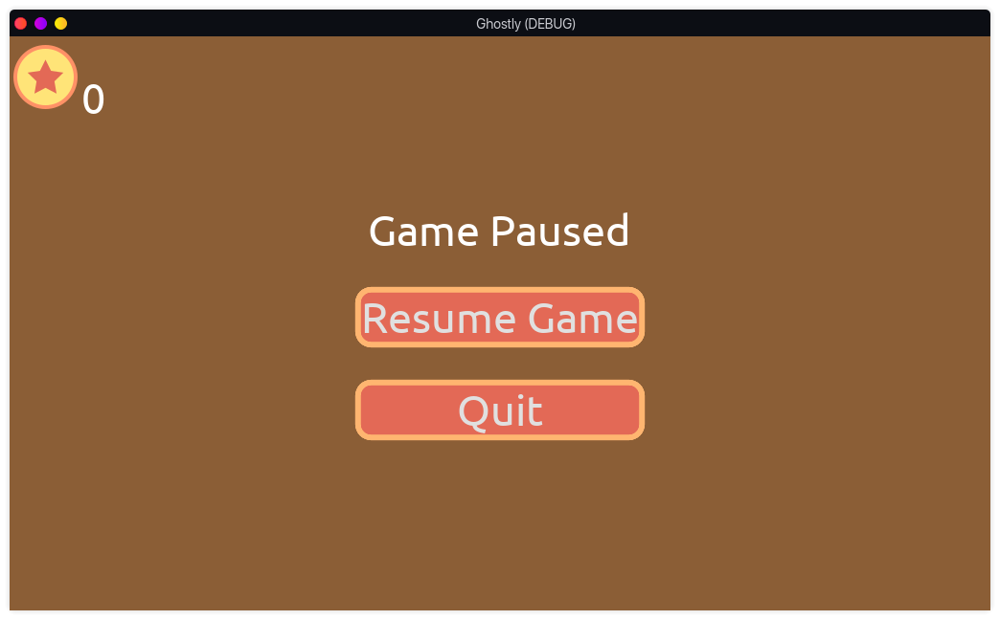

# Ghostly
***

## Description
Ghostly is a game project made using GdScript and the Godot Game Engine as I learn
how to use the engine.

Ghostly is in its early phases and no major build is present as of now

## Screenshots

## How To Install
Ensure you have the Godot Engine installed on your machine

Clone this repository

Compile it using the engine

## Prebuilt game version
As of now there is no version release of the game since it's in early stages of development 

## Contribution
Ghostly is completely open source and all sorts of help is welcome 
and appreciated.

