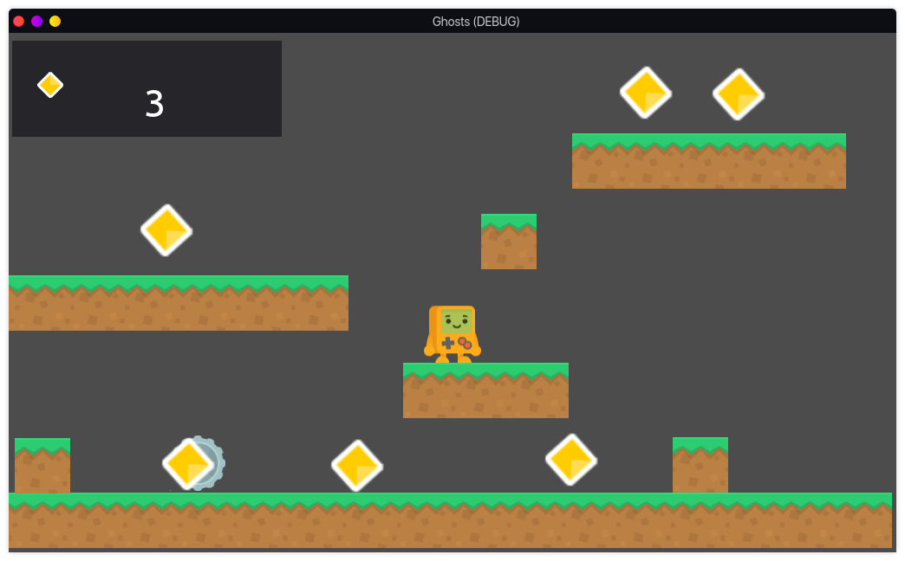

# Ghostly
A fun and challenging platfomer game developed using Godot

## Description
Ghostly is a project made using GdScript and the Godot Game Engine as I learn
how to use the engine.

Ghostly is in its early phases and no major build is present as of now

## Screenshots

## Contribution
Ghostly is completely open source and all sorts of help is welcome 
and appreciated.

