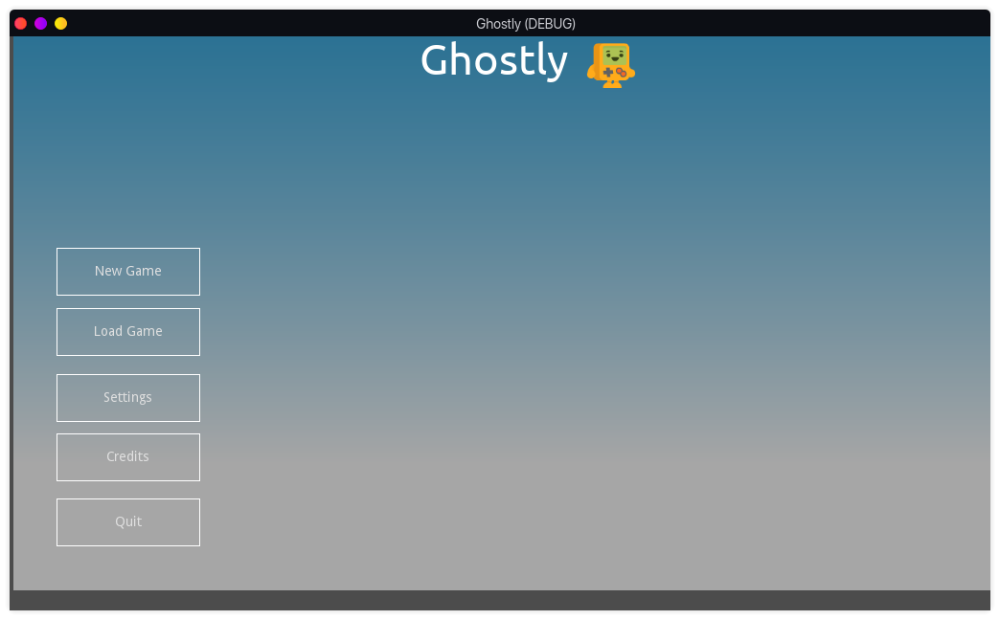
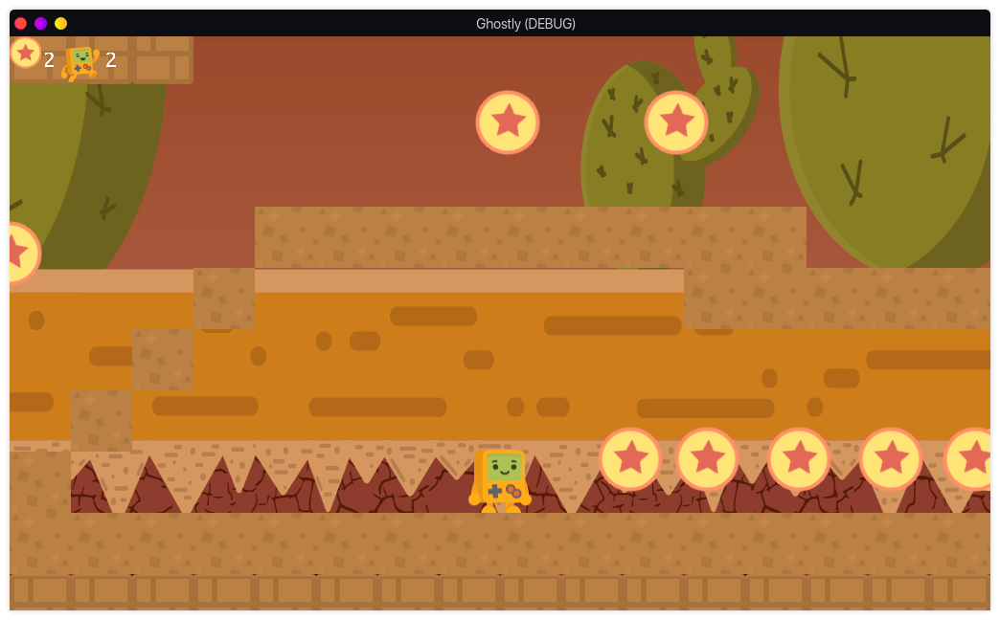

# Ghostly
***

## Description
Ghostly is a platformer game project made using GdScript and the Godot Game Engine as I learn
how to use the engine.

## Screenshots

## How To Install
Ensure you have the Godot Engine installed on your machine

Clone this repository

Compile it using the engine

## Prebuilt game version
Compilation is in progress and I am ready to build and release a beta version of the game

## Contribution
Ghostly is completely open source and all sorts of help and bug tracking are welcome 
and appreciated. 
All music in this project do not belong to me but all rights are reserved to the various owners.

